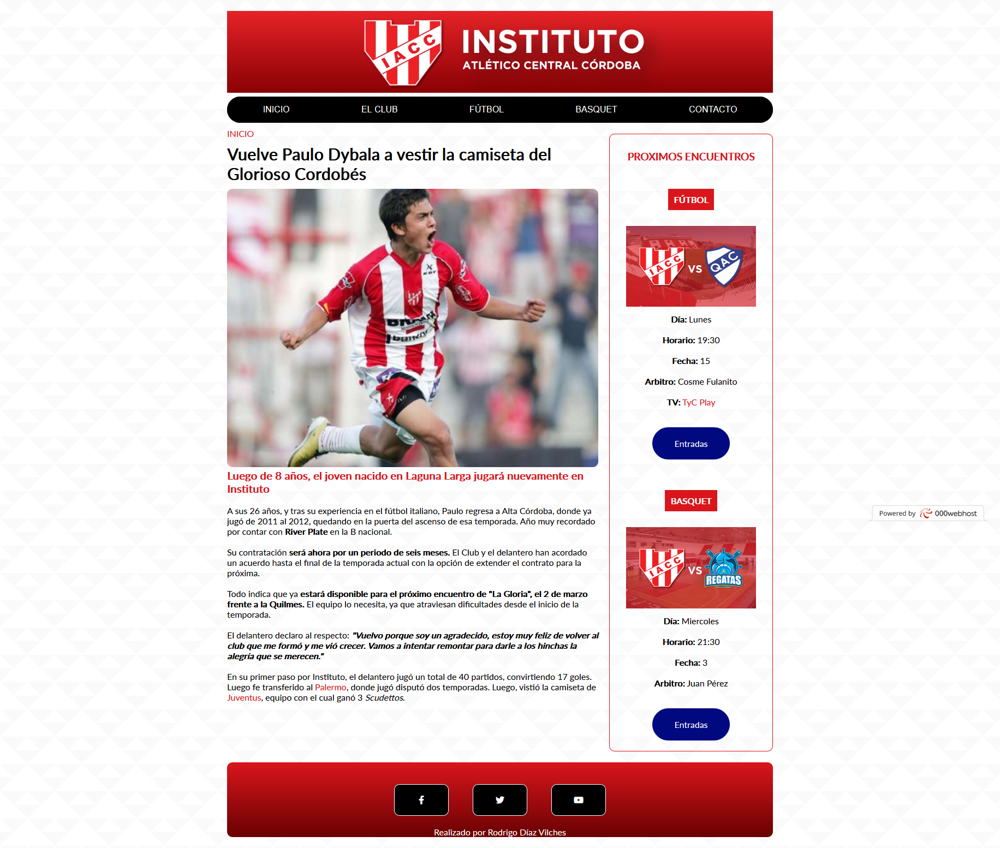
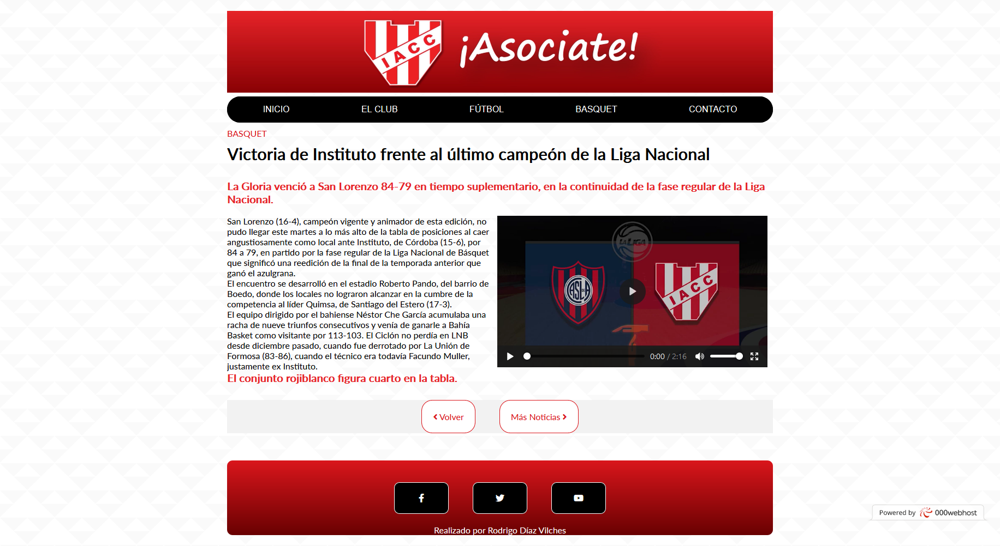
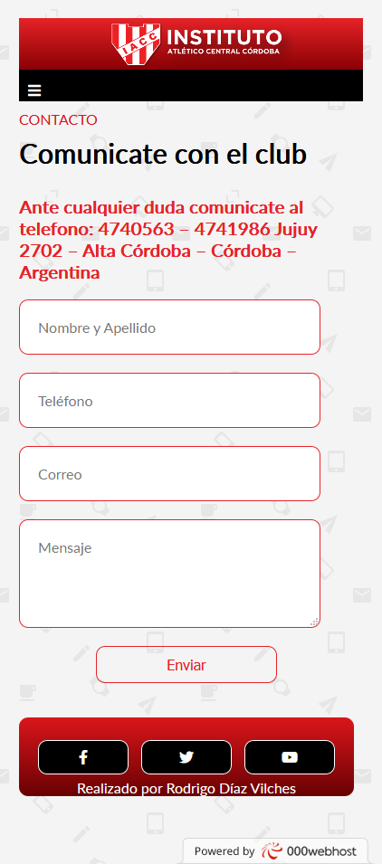
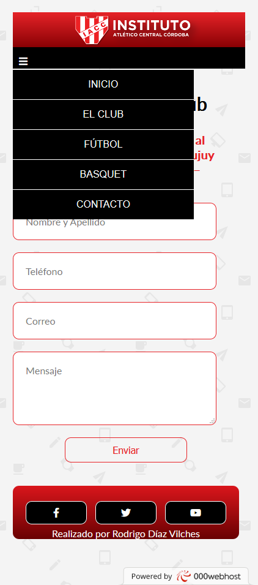

# Sitio web de Instituto de Córdoba Con HTML5 Y CSS3.
### Este es el primer sitio web que hice en HTML5 y CSS3. Fue mi trabajo final para terminar el curso online de Diseño Web Responsive de la UTN-FRRe

#### Version Escritorio

#### Version Smartphone

